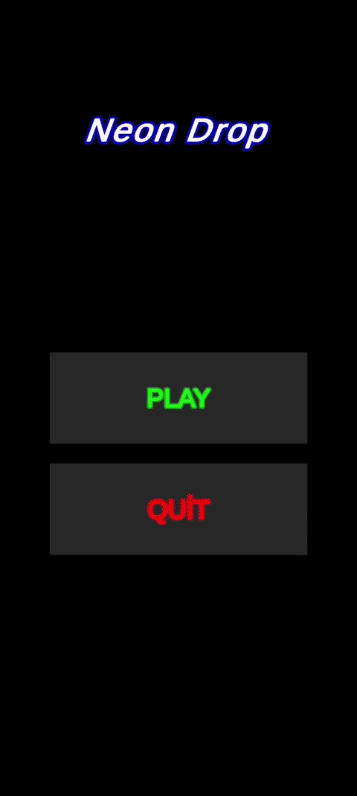
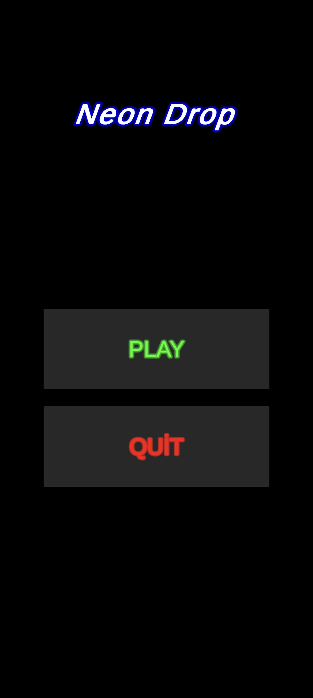
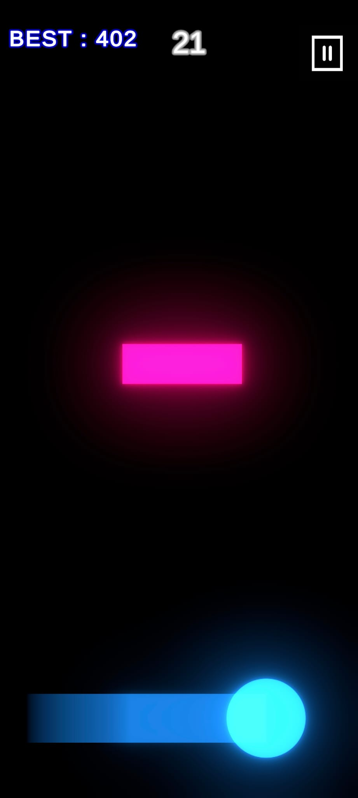
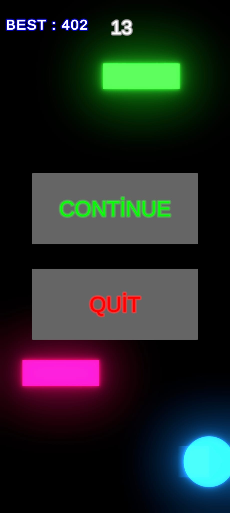
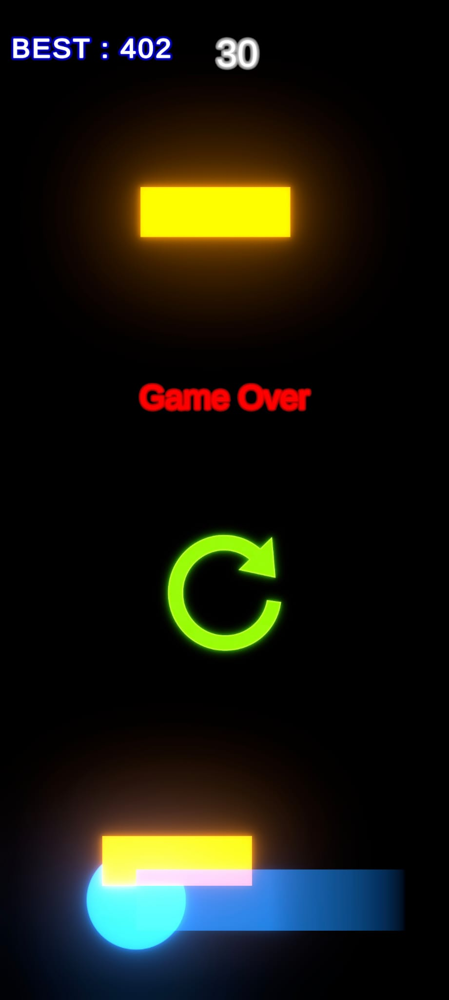

# 🌌 NeonDrop — 2D Cyber-Neon Endless Arcade Game

**NeonDrop** is a fast-paced, reflex-driven 2D mobile arcade game built with Unity 6. Featuring dynamic procedural difficulty, responsive touch mechanics, and a sleek retro-futuristic neon aesthetic powered by the Universal Render Pipeline (URP).

---

## 🎮 Overview & Core Gameplay

The primary objective is simple yet demanding: navigate a vibrant glowing orb through an increasingly rapid cascade of neon obstacles. The game tests reaction time and precision with infinite progression and persistent high-score tracking.

  

### Key Highlights
* **Dynamic Difficulty Curve:** Obstacle speed scales progressively over time, demanding tighter precision and faster reflexes.
* **Neon Aesthetic & Post-Processing:** Universal Render Pipeline (URP 2D) combined with custom Bloom and HDR materials for real-time emission effects.
* **Mobile-Optimized Touch Controls:** Smooth, zero-latency screen tap/drag input handling tailored for portrait mode.
* **Persistent High Score:** Local storage management utilizing `PlayerPrefs` for real-time best-score comparison.
* **Modular Game Architecture:** Integrated State Management covering Main Menu navigation, In-Game Pause/Resume states, and Game Over logic.
* **Production-Ready Build:** Compiled using Android NDK with IL2CPP backend, targeting ARM64 and ARMv7 architectures.

---

## 📸 Screenshots

  
  
  
  

---

## 🛠️ Tech Stack & Architecture

* **Engine:** Unity 6 (6000.4.2f1)
* **Language:** C# (.NET Framework)
* **Rendering:** Universal Render Pipeline (URP 2D) with Bloom & Post-Processing
* **UI Framework:** TextMeshPro (SDF Materials, Scalable Canvas 1080x1920)
* **Scripting Backend:** IL2CPP (Android ARMv7 / ARM64)
* **Build & Tooling:** Gradle 8.x, Android SDK/NDK, OpenJDK
* **Version Control:** Git & GitHub

---

## 🚀 Getting Started

### Prerequisites
* Unity Hub with Unity 6 (6000.4.2f1) installed.
* Android Build Support module (including Android SDK & NDK Tools and OpenJDK).

### Running in Unity Editor
1. Clone the repository: `https://github.com/alitutkac/NeonDrop.git`
2. Open Unity Hub, click **Add project from disk**, and select the `NeonDrop` directory.
3. Open `Assets/Scenes/MainMenu.unity` and hit the **Play** button.

### Installing the Android APK
1. Head over to the Releases section on GitHub.
2. Download `NeonDrop.apk` directly onto your Android device.
3. Enable installation from unknown sources and launch the game.

---

## 👨‍💻 Developer

**Ali TUTKAÇ**  
*Computer Engineering Student — Karadeniz Technical University*  
* **GitHub:** [@alitutkac](https://github.com/alitutkac)
